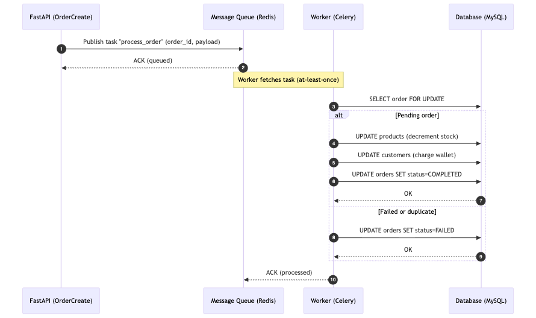

# System Architecture Overview

The following diagram illustrates the high-level architecture of the e-commerce order processing system. It highlights the asynchronous flow between the API, message queue, background workers, and database.

## Get starting
```bash
git clone <repo-url> ecommerce
cd ecommerce
docker compose up --build
```

Once containers are healthy, the API should be available (e.g. http://localhost:8000).

### Running Performance & Concurrency Tests

Install k6 (pick one method):

Linux (Debian/Ubuntu):
```bash
sudo gpg --no-default-keyring --keyring /usr/share/keyrings/k6-archive-keyring.gpg --keyserver hkp://keyserver.ubuntu.com:80 --recv-keys C5AD17C747E3415A3642D57D77C6C491D6AC1D69
echo "deb [signed-by=/usr/share/keyrings/k6-archive-keyring.gpg] https://dl.k6.io/deb stable main" | sudo tee /etc/apt/sources.list.d/k6.list
sudo apt-get update && sudo apt-get install -y k6
```

Fedora/CentOS:
```bash
sudo dnf install https://dl.k6.io/rpm/repo.rpm
sudo dnf install k6
```

macOS (Homebrew):
```bash
brew install k6
```

Windows (Chocolatey or Winget):
```powershell
choco install k6
# or
winget install k6 --source winget
```

Docker (no local install):
```bash
docker pull grafana/k6
# example run:
docker run --rm -v "$PWD/tests:/scripts" grafana/k6 run /scripts/req-3-2-2_test_high_volume_test.js
```

### Execute Tests
High volume (REQ-3.2.2):
```bash
k6 run tests/req-3-2-2_test_high_volume_test.js
```

Product read performance (REQ-3.1.1):
```bash
k6 run tests/req-3-1-1_test_get_product_perf.js
```

Race condition simulation (REQ-3.2.1):
```bash
python tests/req-3-2-1_test_race_condition.py
```

## Order Request Lifecycle



**Flow Summary:**
1. FastAPI receives the order request.
2. The request is placed in a durable message queue (Redis/RabbitMQ).
3. A Celery worker consumes tasks from the queue asynchronously.
4. The worker updates MySQL atomically (stock, wallet, and order status).
5. This ensures resilience, concurrency safety, and no data loss on restart.


## Resource Utilization During High-Load Test

To evaluate system efficiency under the 10,000-order load test (REQ-3.2.2), resource usage was monitored using docker stats.

The following table shows the system while idle:

| Service      | CPU    | Memory Usage          | Memory % | Network I/O (Rx / Tx) | Block I/O        | PIDs |
|--------------|--------|-----------------------|---------:|-----------------------|------------------|-----:|
| FastAPI App  | 2.28%  | 907.7 MiB / 7.65 GiB  | 11.6%    | 520 kB / 559 kB       | 0 B / 16.4 kB    | 23   |
| Redis Broker | 0.93%  | 10.3 MiB / 7.65 GiB   | 0.13%    | 525 kB / 491 kB       | 0 B / 0 B        | 6    |
| MySQL DB     | 0.80%  | 386.7 MiB / 7.65 GiB  | 4.9%     | 34 kB / 60.4 kB       | 115 kB / 15.7 MB | 43   |

The following table shows average container utilization while processing ~1000 RPS (high-load):

| Container          | CPU %    | Mem Usage / Limit     | Mem %  | Net I/O (Rx / Tx)  | Block I/O        | PIDs |
|--------------------|----------|------------------------|-------:|--------------------|------------------|-----:|
| ecommerce-app      | 853.95%  | 1.261 GiB / 7.654 GiB  | 16.48% | 5.12 MB / 6.11 MB  | 0 B / 20.5 kB    | 472  |
| ecommerce-redis    | 33.37%   | 17.19 MiB / 7.654 GiB  | 0.22%  | 4.07 MB / 1.74 MB  | 0 B / 12.3 kB    | 6    |
| ecommerce-mysql    | 138.32%  | 421.4 MiB / 7.654 GiB  | 5.38%  | 166 kB / 226 kB    | 115 kB / 16.9 MB | 50   |

Key deltas (Idle → High-Load):

| Service   | CPU Idle | CPU Load | Δ CPU     | Mem Idle    | Mem Load     | Δ Mem (Approx) |
|-----------|----------|----------|-----------|-------------|--------------|----------------|
| FastAPI   | 2.28%    | 853.95%  | +851.67%  | 907.7 MiB   | 1.261 GiB    | +~384 MiB      |
| Redis     | 0.93%    | 33.37%   | +32.44%   | 10.3 MiB    | 17.19 MiB    | +~6.9 MiB      |
| MySQL     | 0.80%    | 138.32%  | +137.52%  | 386.7 MiB   | 421.4 MiB    | +~34.7 MiB     |

For continuous tracking, cAdvisor + Prometheus can scrape and aggregate these container metrics automatically.

# Low Level Architecture Overview

[![](https://mermaid.ink/img/pako:eNrVWXtO40gav8onSzMdpp0Qh84OWEu30klgo4GEIWmNtEKKCrsCHhw7U7ZhsigHmBPsBfYme5M5yXz18KMcOwmtllbLP2BXfe_f9zKvhhO61LCNiP6W0MChA488MLK8CwB_VoTFnuOtSBBD3_doEG-_vyBR3LsZVRAkURwuKZtS9uw5dPvCDQvdxIlrzyfM3UF9vZ7-fLX9-pa6XlShDPUpW_8SsifKajX5nHi-y8_ljXEYUwifKVO2m_o1G6wW9BkleCu1FS788AUaN5PpDI4d9TI6kvwkl-bHj--Vz2yQF8nKO3628vt_v2fHH1-TiLKALKkNd8av4WMwd0N6Z2wkL8WBMyv52QZH6DRP2TXcezNTUOqbKqRTcmbCqzaMxtPh7Qx_zSagq9VI1TLhhfg-jef3xCcInPNuu91utRVrwaeJHJvb6qkXc8-Fxpcvo0GNNpw4c1R6eEujVRhEVPeCkCO8a0OnbamouNKPBXkm1Glvg1R_c3DwOy24pBl04MWLH2GwRt6egy8RWcEDNC6HGN6VvBIdv3ruph4L4q6CQk6i_kLltyOvJ5AND2iPui-CntOa4BDnkZ7PWJIGXycuxH46vBr2Z_ADXNxOrlMeMvi__GN4OyywhXP4VI53WSn1_HpPIora4TsTMCDOkwle4MUe8efiUZlXp1zZ_fpzQ-mk26YOkbxMTVx37spgSZ0aR4WwM-_hMYZwAWWyPvGdxOcJL1SeMxJ7ofCMeD7WDBLvP3bb39kgRMB__40Voy1ed7rN8kFHHPz5x386Xf2ge6BNTsIYYkrag5HJHc75LIgTh6yS1Y6open22mq1TF3CrnhpqVtitStz2zD5SSZtEboyX4v40RRRcDo8c0-ysi06jKzZTehF64CnbujQKBLZK6tzyC8dWsPl5YrCsyuPi43OBuzDCZ0LRiKLxalWt4v3kV4nF4QyN5PEcz80qonei0bJgSbslfJaLvXJupGyMIUdWhXJTapMGMVUdluISfQkzZGleMafRwOsUwFlvEBLFoJIIEG3ZJaTV5igYUyexCROogyymRWID36AkRqOB6Px5WYXBDvQcxy6yrrHNpc7Q_ERzbiMOWGMqUqphJREWQFY9-vUQ8WBRLqBN_TCrFIKkHCp7MO5YrsDpHBb4Flb6wvglZW-gKVPVeFOpwWXLld4EDhrwC7jPG3NAJpF9HcvitEPyqSQIdeAFrUlvpr-oOcj8N116r0UCVsmoRSFvVsaJyyQ_c4FRqPEj2Uo0wD2J9c3V8PZcHB80RtdDQcKD9SPKIzpy1a8akTmXvw8vByNYXbbG097_dloMhby3thHxcHF5Ba-3Ax6s2EutNLlN8PpdHQ9ms5Gfbia9GXVvGH0GWEcASNY9J0wcLEdYS6Iw0ngr8GCF6E8uieQyCp6tC5g6YzT4JKG6byWh6vCNTqDvG-qpiv7m9ArESmhRESjIKYMexU9QEY1iPVxVXq6OHLucnWdA7Lx_g0eqBqlCwlWyN-aPpFWX3TUfEXyCnSuys_Rfr0lkuU-4FbpzBNtyrsn9J6J55N7n8L38FnOxDBNFgscZLO1rxqRusie78Mz8T2XCOjhmqVnbYWnlKNkMPREmeJMLLo7hk3-boK1ZxQ9SIqOEi5G3weQXelFs4DZSlS9QXoBB9JCHlfk8S4rTe92VuHdQpDJ9WhWrEe7wpe2Koyb80iCBxph5VguvThtgQSN9Bx0xnqH8Lz-ThOH182KxpkZt9EZ5U-iBI-CKMOdBOe38Kws9e--hf9qDL_ABKLuKyZbFAa2bkZxwznEbJWB__-Gq-wpmE4DVQ2yP8psm4qvmP8QiytMQ15CDhzvP8jFXNY-OROqRVz66DiD5oHL-BbZngGer-H5-J5S1YzhXzuI5SVfFy6e1KhjpqV_TmITkpWr_t58xTh92NpWTvrtfqY1u1r1Dgx1Fzc5Di9fRVvb2AoBO3bErTftcNvke8IuL9VH_n8R_3x62JTna5UZXpTX5TxJa7TcGnRrKb52NKuYaXT70lHsbZIP_Iq1Q66CXtUQpfdTnWyKwy3OVDEjQUQcPhLBImSyr_KOKzDji1kJwhVlcmraZ9zeMaI37g-v9LK_k9Pbx6H3BWwdKGTPZPcerH2MdjWouoRQ80hV4MoFMCsHigYacf69VDRplTQY8b1ZU-QnOyQ0FgSZHJXa375ivL8CpzdkDV6i5uRB_NugX4TXKluhjcMr7E90DSPegZd4KvkMaIzmRGUGKkRNuOFb85Kv-A74GFjxKS3fto6Els2qzJBzZ6QubH1ViCq_tXCRW9-bFAv5_WWVbfLqtRgsGI2RRHy2vyfOU7hYbLlEW2yagLeiOd9ixWd0xUvu0_MVowsaO4_zZeLH3gqdyc6tVIskDptSHBqJXur5aM9yPWQsZIZpPDDPNWwONdPAHFwS_mi8cnXujBhv0juDR9OlC4Lc74y7YINkKxL8MwyXKSULk4dHwxYQMw3ZTdU_87IriDnK-mESxIbdbf9N8DDsV-N3wz4567TOrK5lWZ2zTudD-7RrGmvDblon3VbnrG39eNq2Tjtn1umHjWn8S8htt87aJ3hw2j3pdDtty9r8BaTTQNA?type=png)](https://mermaid.live/edit#pako:eNrVWXtO40gav8onSzMdpp0Qh84OWEu30klgo4GEIWmNtEKKCrsCHhw7U7ZhsigHmBPsBfYme5M5yXz18KMcOwmtllbLP2BXfe_f9zKvhhO61LCNiP6W0MChA488MLK8CwB_VoTFnuOtSBBD3_doEG-_vyBR3LsZVRAkURwuKZtS9uw5dPvCDQvdxIlrzyfM3UF9vZ7-fLX9-pa6XlShDPUpW_8SsifKajX5nHi-y8_ljXEYUwifKVO2m_o1G6wW9BkleCu1FS788AUaN5PpDI4d9TI6kvwkl-bHj--Vz2yQF8nKO3628vt_v2fHH1-TiLKALKkNd8av4WMwd0N6Z2wkL8WBMyv52QZH6DRP2TXcezNTUOqbKqRTcmbCqzaMxtPh7Qx_zSagq9VI1TLhhfg-jef3xCcInPNuu91utRVrwaeJHJvb6qkXc8-Fxpcvo0GNNpw4c1R6eEujVRhEVPeCkCO8a0OnbamouNKPBXkm1Glvg1R_c3DwOy24pBl04MWLH2GwRt6egy8RWcEDNC6HGN6VvBIdv3ruph4L4q6CQk6i_kLltyOvJ5AND2iPui-CntOa4BDnkZ7PWJIGXycuxH46vBr2Z_ADXNxOrlMeMvi__GN4OyywhXP4VI53WSn1_HpPIora4TsTMCDOkwle4MUe8efiUZlXp1zZ_fpzQ-mk26YOkbxMTVx37spgSZ0aR4WwM-_hMYZwAWWyPvGdxOcJL1SeMxJ7ofCMeD7WDBLvP3bb39kgRMB__40Voy1ed7rN8kFHHPz5x386Xf2ge6BNTsIYYkrag5HJHc75LIgTh6yS1Y6open22mq1TF3CrnhpqVtitStz2zD5SSZtEboyX4v40RRRcDo8c0-ysi06jKzZTehF64CnbujQKBLZK6tzyC8dWsPl5YrCsyuPi43OBuzDCZ0LRiKLxalWt4v3kV4nF4QyN5PEcz80qonei0bJgSbslfJaLvXJupGyMIUdWhXJTapMGMVUdluISfQkzZGleMafRwOsUwFlvEBLFoJIIEG3ZJaTV5igYUyexCROogyymRWID36AkRqOB6Px5WYXBDvQcxy6yrrHNpc7Q_ERzbiMOWGMqUqphJREWQFY9-vUQ8WBRLqBN_TCrFIKkHCp7MO5YrsDpHBb4Flb6wvglZW-gKVPVeFOpwWXLld4EDhrwC7jPG3NAJpF9HcvitEPyqSQIdeAFrUlvpr-oOcj8N116r0UCVsmoRSFvVsaJyyQ_c4FRqPEj2Uo0wD2J9c3V8PZcHB80RtdDQcKD9SPKIzpy1a8akTmXvw8vByNYXbbG097_dloMhby3thHxcHF5Ba-3Ax6s2EutNLlN8PpdHQ9ms5Gfbia9GXVvGH0GWEcASNY9J0wcLEdYS6Iw0ngr8GCF6E8uieQyCp6tC5g6YzT4JKG6byWh6vCNTqDvG-qpiv7m9ArESmhRESjIKYMexU9QEY1iPVxVXq6OHLucnWdA7Lx_g0eqBqlCwlWyN-aPpFWX3TUfEXyCnSuys_Rfr0lkuU-4FbpzBNtyrsn9J6J55N7n8L38FnOxDBNFgscZLO1rxqRusie78Mz8T2XCOjhmqVnbYWnlKNkMPREmeJMLLo7hk3-boK1ZxQ9SIqOEi5G3weQXelFs4DZSlS9QXoBB9JCHlfk8S4rTe92VuHdQpDJ9WhWrEe7wpe2Koyb80iCBxph5VguvThtgQSN9Bx0xnqH8Lz-ThOH182KxpkZt9EZ5U-iBI-CKMOdBOe38Kws9e--hf9qDL_ABKLuKyZbFAa2bkZxwznEbJWB__-Gq-wpmE4DVQ2yP8psm4qvmP8QiytMQ15CDhzvP8jFXNY-OROqRVz66DiD5oHL-BbZngGer-H5-J5S1YzhXzuI5SVfFy6e1KhjpqV_TmITkpWr_t58xTh92NpWTvrtfqY1u1r1Dgx1Fzc5Di9fRVvb2AoBO3bErTftcNvke8IuL9VH_n8R_3x62JTna5UZXpTX5TxJa7TcGnRrKb52NKuYaXT70lHsbZIP_Iq1Q66CXtUQpfdTnWyKwy3OVDEjQUQcPhLBImSyr_KOKzDji1kJwhVlcmraZ9zeMaI37g-v9LK_k9Pbx6H3BWwdKGTPZPcerH2MdjWouoRQ80hV4MoFMCsHigYacf69VDRplTQY8b1ZU-QnOyQ0FgSZHJXa375ivL8CpzdkDV6i5uRB_NugX4TXKluhjcMr7E90DSPegZd4KvkMaIzmRGUGKkRNuOFb85Kv-A74GFjxKS3fto6Els2qzJBzZ6QubH1ViCq_tXCRW9-bFAv5_WWVbfLqtRgsGI2RRHy2vyfOU7hYbLlEW2yagLeiOd9ixWd0xUvu0_MVowsaO4_zZeLH3gqdyc6tVIskDptSHBqJXur5aM9yPWQsZIZpPDDPNWwONdPAHFwS_mi8cnXujBhv0juDR9OlC4Lc74y7YINkKxL8MwyXKSULk4dHwxYQMw3ZTdU_87IriDnK-mESxIbdbf9N8DDsV-N3wz4567TOrK5lWZ2zTudD-7RrGmvDblon3VbnrG39eNq2Tjtn1umHjWn8S8htt87aJ3hw2j3pdDtty9r8BaTTQNA)